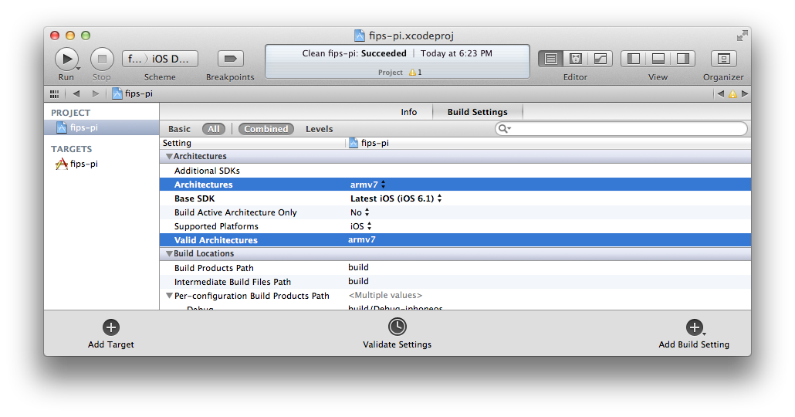
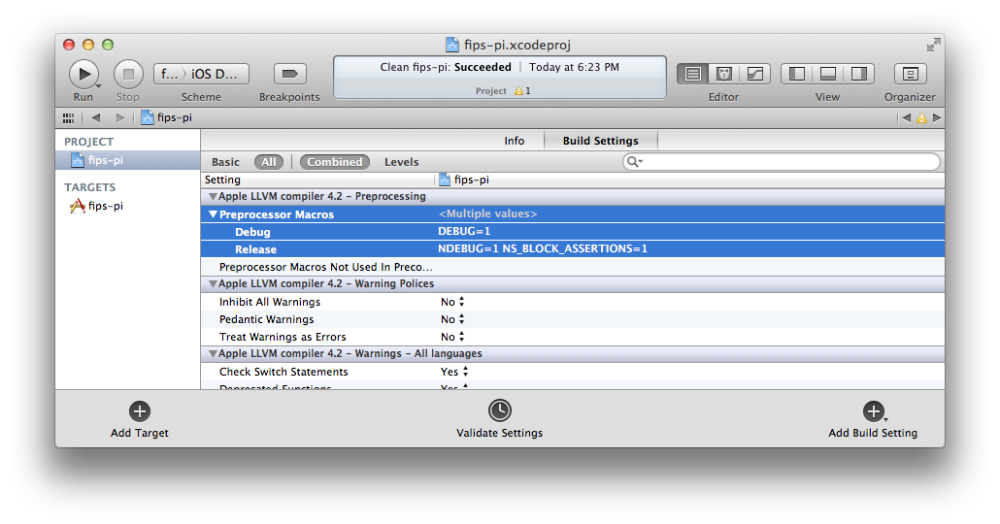
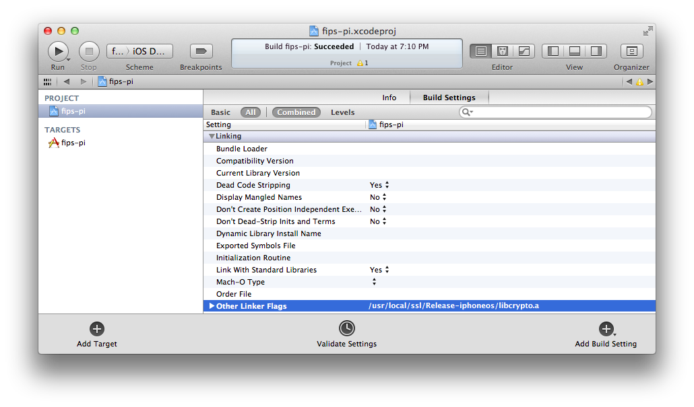
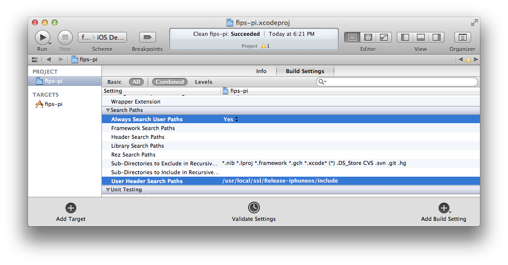
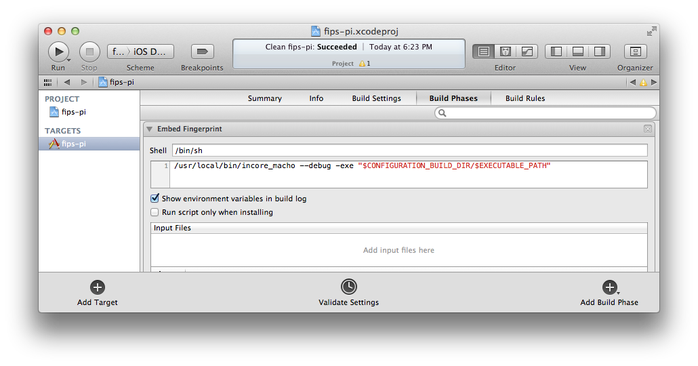

#iOS-openSSL-FIPS

iOS-openSSL-FIPS is an open-source project that creates the iOS (armv7) FIPS version of the openssl libraries: libssl.a and libcrypto.a 

##Build and Install

The build and install process is simple, just execute the build.sh script. The process will install the libraries into /usr/local/ssl/Release-iphoneos/ and the incore_macho utility into /usr/local/bin/.  

	/usr/local/ssl/Release-iphoneos/

		include/
		lib/
		bin/
		libssl.a
		libcrypto.a
  
	/usr/local/bin/
	
		incore_macho

**NOTE:** You may have to execute the build script with admin privileges e.g. sudo ./build.sh

##Creating Applications Which Reference the FIPS Object Module

Only minor modifications are needed to adapt most applications that currently use OpenSSL for cryptography to use the FIPS capable OpenSSL with the FIPS Object Module. 

- Use the FIPS Object Module for all cryptography
- Initialize FIPS mode with FIPS_mode_set()
- Generate application executable object with embedded FIPS Object Module digest
- Protect critical security parameters

Details are explained in chapter 5 of the User Guide for the OpenSSL FIPS Object Module v2.0  ***http://www.openssl.org/docs/fips/UserGuide-2.0.pdf***

##Xcode Example

The fips-pi.tar archive contains a sample test Xcode project (fips-pi.xcodeproj). Un-tar the archive and ensure the following are set:

